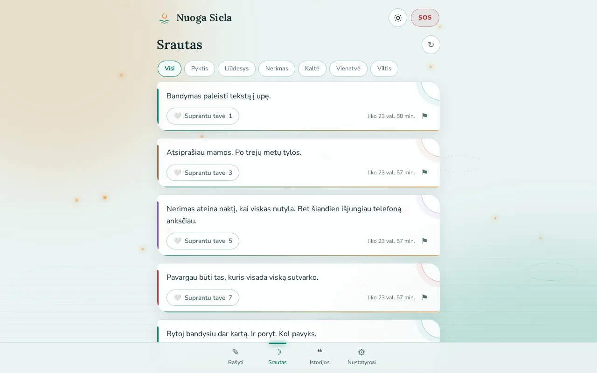
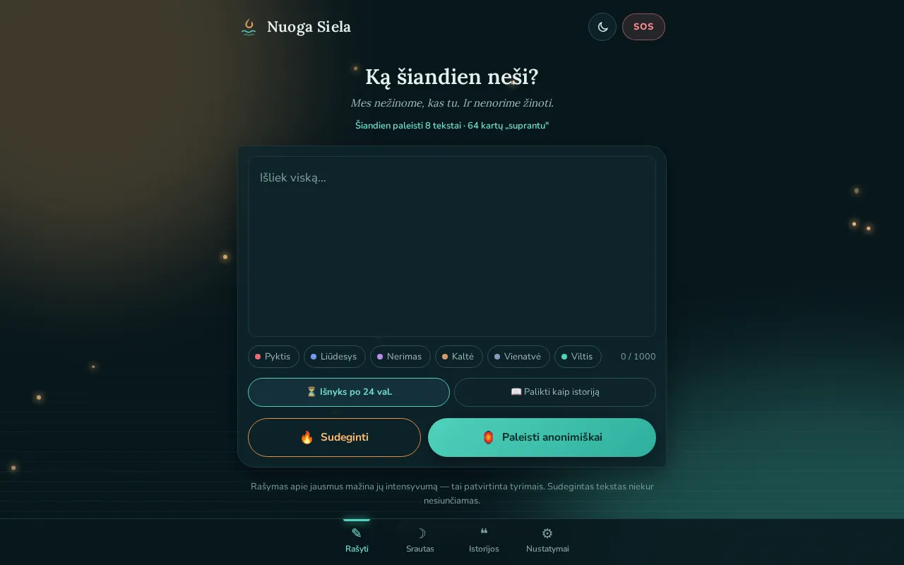
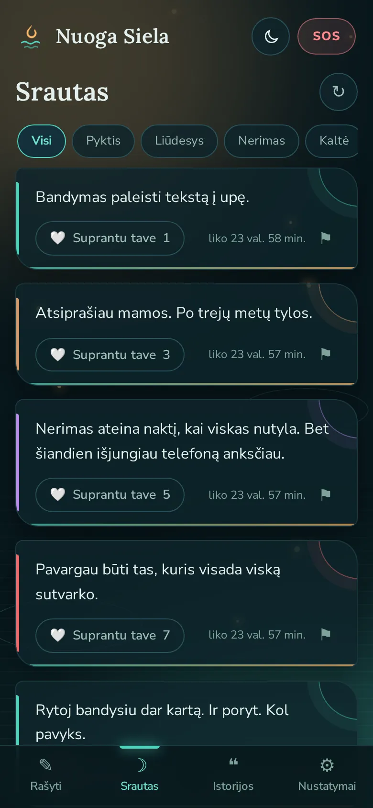

<p align="right"><strong>English</strong> · <a href="README.lt.md">Lietuviškai</a></p>

# 🔥🌊 Nuoga Siela

**An anonymous place to let it out: write what you feel, then burn it or set it adrift on the river.
We don't know who you are, and we don't want to.**

🌐 **Live site:** [nuogasiela.lt](https://nuogasiela.lt) · 💻 **Code:**
[github.com/brutall100/nuoga-siela](https://github.com/brutall100/nuoga-siela)



| Dark mode                                                 | Phone (390px)                                                                   |
| --------------------------------------------------------- | ------------------------------------------------------------------------------- |
|  |  |

## About

Sometimes you need to say what hurts without telling anyone. That's what _Nuoga Siela_ ("Naked Soul"
in Lithuanian) is for. There are no accounts, no names and no comments. Other people can only tap "I
understand you".

The design comes from the Lithuanian midsummer (Joninės) tradition of floating wreaths and candles
down a river at night, so whatever is heavy drifts away. Fire is for burning, water is for letting
go.

## Features

- ✍️ **Write freely.** Tag an emotion (anger, sadness, anxiety, guilt, loneliness, hope).
- 🔥 **Burn it.** The text turns into embers and disappears. It is never sent to the server.
- 🏮 **Release it.** Choose the **stream**, which is physically deleted after 24 h, or a **story**,
  which stays until you delete it.
- 🤍 **"I understand you".** Support without comments, one vote per device.
- 🆘 **SOS.** Helplines and a breathing circle. If the text contains crisis words, help is offered
  gently and the post is never blocked.
- 🔊 **Scream room.** Audio lives only in the phone's memory and is never uploaded.
- 🌗 **Light and dark mode.** Follows the system setting, has a toggle, and doesn't flash while
  loading.
- 🌊 **Living background.** Ripples spread on the water, lantern lights rise and soft glows drift.
  Phones get half the particles, and `prefers-reduced-motion` turns them off.
- 🌍 **LT / EN**, installable PWA, SEO (sitemap, Atom feed, server-rendered story pages).

### Anonymity is enforced by technology, not just promised

- The device ID is created in the browser (`crypto.randomUUID()`). The server immediately turns it
  into `sha256(salt + uuid)` and never stores the original.
- IP addresses are never stored. The server log keeps only `method path status`.
- Stream posts are written with `expireIn: 24h`, so Deno KV deletes them physically on its own.
- Fonts are self-hosted, so Google never sees who visits.

## Built with

| Area    | What                                                                                                                               |
| ------- | ---------------------------------------------------------------------------------------------------------------------------------- |
| Server  | [Deno](https://deno.com) 2 + Deno KV, zero dependencies                                                                            |
| Client  | Vanilla HTML / CSS / JS (PWA), no libraries and no build step                                                                      |
| Fonts   | [Lora](https://fonts.google.com/specimen/Lora) for headings, [Nunito Sans](https://fonts.google.com/specimen/Nunito+Sans) for text |
| Testing | `deno test`, CI on GitHub Actions (fmt + lint + test)                                                                              |

**"Let it drift" color palette** (every color lives at the top of `public/css/main.css`, in
`:root`):

| Role                 | Dark      | Light     |
| -------------------- | --------- | --------- |
| Background           | `#08171C` | `#EAF4F2` |
| Surface              | `#0F242B` | `#FFFFFF` |
| Text                 | `#E4F1EE` | `#10292E` |
| Accent (water)       | `#4FD1BD` | `#0B7A6A` |
| Second accent (lamp) | `#FFB86B` | `#E08A33` |

All contrast ratios are checked against WCAG: body text is at least 4.5:1, UI elements at least 3:1.

## What I learned

- How to guarantee anonymity through **architecture**: hashes instead of IDs, TTLs instead of
  "hidden" flags, and no IPs in logs.
- How a reversed timestamp at the start of a Deno KV key returns the newest items first with no
  index.
- How an SPA with real URL paths (`history.pushState`) and server-rendered pages becomes visible to
  Google.
- How to build a living background that doesn't load the CPU: only `transform` and `opacity` are
  animated, and particles are created once.
- How a strict CSP (`script-src 'self'`) changes habits: no inline scripts or styles, and the theme
  is set by a separate file in `<head>`.

## Run it locally

You need [Deno 2](https://docs.deno.com/runtime/getting_started/installation/).

```bash
git clone https://github.com/brutall100/nuoga-siela.git
cd nuoga-siela
cp .env.example .env   # optional locally; change DEVICE_SALT in production
deno task dev          # http://localhost:8000
```

In `.env` you can set `PORT`, `DEVICE_SALT` (in production use a long random string:
`openssl rand -hex 32`), `POST_TTL_MS`, `KV_PATH` and `INDEXNOW_KEY`. Each one is explained in
`.env.example`.

Other commands:

```bash
deno task test   # server tests
deno task lint   # lint (main.ts + server/)
deno fmt         # format
```

> This project needs a server (Deno + KV), so GitHub Pages can't run it. The live version runs on
> [Deno Deploy](https://deno.com/deploy) at [nuogasiela.lt](https://nuogasiela.lt). To deploy:
> dash.deno.com → New Project → this repo → entrypoint `main.ts` → set `DEVICE_SALT`.

## Project structure

```
main.ts              server: static files, /api, SSR story pages, sitemap, Atom, CSP
server/api.ts        API (JSON)
server/store.ts      Deno KV: posts, stories, hugs, rate limits, stats
server/filter.ts     spam / personal data filter and crisis word detection
public/index.html    single page with every screen
public/css/main.css  design system and palette (:root)
public/js/theme.js   light / dark mode (no flash)
public/js/river.js   living background (ripples, lanterns)
public/js/ui.js      button ripple, reveal on scroll, count-up
public/js/app.js     routing, writing, stream, stories, settings
public/js/burn.js    burn animation (Canvas)
public/js/scream.js  scream room (audio only in RAM)
public/fonts/        Lora and Nunito Sans (woff2 + OFL licenses)
public/images/       og-image.webp
docs/                README screenshots
```

### API

| Method | Path                          | What                                                                      |
| ------ | ----------------------------- | ------------------------------------------------------------------------- |
| `POST` | `/api/posts`                  | `{text, emotion, kind}` + `X-Device`. Returns `sos: true` on crisis words |
| `GET`  | `/api/posts?emotion=`         | stream, newest first                                                      |
| `GET`  | `/api/stories?emotion=&sort=` | stories (`suprastos` = most understood, `naujausios` = newest)            |
| `GET`  | `/api/mine`                   | my texts with their hug counts                                            |
| `GET`  | `/api/stats`                  | `{postsToday, hugsToday}`                                                 |
| `POST` | `/api/posts/:id/hug`          | "I understand you" (once per device)                                      |
| `POST` | `/api/posts/:id/report`       | report; after 3 reports the post is hidden automatically                  |
| `POST` | `/api/mine/delete`            | delete all my posts                                                       |

## Credits

- Fonts: [Lora](https://github.com/cyrealtype/Lora-Cyrillic) (The Lora Project Authors) and
  [Nunito Sans](https://github.com/Fonthausen/NunitoSans) (The Nunito Sans Project Authors), both
  under the [SIL Open Font License 1.1](https://openfontlicense.org). The license texts are in
  `public/fonts/`.
- Helplines: [Vilties linija](https://www.viltieslinija.lt) 116 123,
  [Jaunimo linija](https://www.jaunimolinija.lt) 8 800 28888.
- Inspiration: Vent, 7 Cups, Jodel. Psychology: J. Pennebaker (expressive writing).

## License

[MIT](LICENSE) © 2026 brutall100
